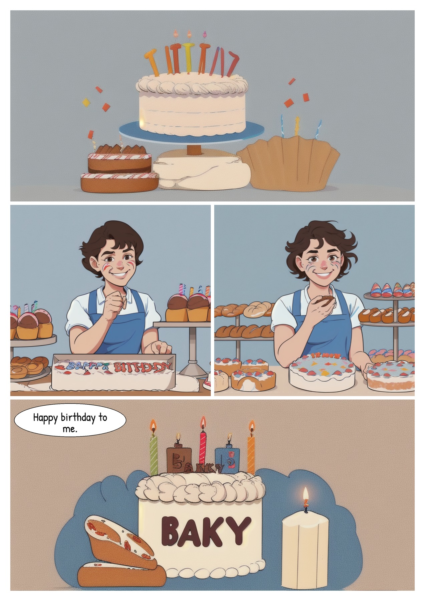
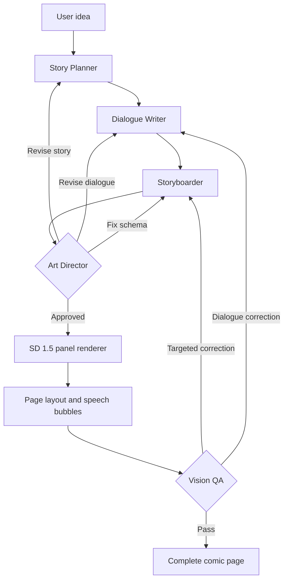

# ComicBookGenerator

Local AI comic studio that turns a short idea into a complete comic page: plan the story, write dialogue, render panels with Stable Diffusion 1.5, compose the page, and review it with vision QA.

## Demo

The page below is a small, deliberately simple SD 1.5 example. It was rendered at 80 steps and checked panel-by-panel for a readable sequence, recurring subject, and usable speech placement.

<p align="center">
  
</p>

The demo keeps the story simple because SD 1.5 is much more reliable with one recurring subject, a small number of props, and one clear action per panel. It is a visual example of the workflow, not a claim that every generated page will be perfect.

## What it does

- Creates a short, causal storyboard with a clear visual punchline.
- Writes concise dialogue in English or Vietnamese.
- Renders panels locally with Stable Diffusion 1.5.
- Loads LoRA styles from `models/loras`.
- Uses Compel for long prompts and prompt weighting.
- Composes flexible page layouts and adds readable speech bubbles after rendering.
- Runs vision QA panel by panel and retries targeted corrections.
- Lets you edit a panel image prompt and regenerate only that panel.
- Lets you edit speech bubbles without rerendering the image.
- Saves or downloads finished pages from the UI.
- Streams planner, renderer, and QA progress to the browser.

## How the workflow works



1. The Story Planner turns the idea into structured beats, characters, actions, props, and payoff.
2. The Dialogue Writer creates short, natural dialogue in the requested language.
3. The Storyboarder converts the plan into renderable JSON with fixed character cards and per-panel requirements.
4. The Art Director validates pacing, causality, dialogue, and schema consistency.
5. The selected local diffusion pipeline renders each panel. Compel chunks long SD 1.5 prompts; it does not draw the speech text.
6. The compositor places panels and draws speech bubbles/text cleanly after diffusion.
7. Vision QA checks the actual page, not only the prompt. Failed pages return targeted corrections for another attempt.

## Requirements

- Windows, Python 3.13+, and Node.js LTS.
- An NVIDIA GPU with a CUDA-compatible PyTorch installation is recommended for local rendering.
- An OpenAI-compatible vision/chat API for story planning and QA.
- A local SD 1.5 checkpoint and any desired LoRAs.

## Setup

From the project directory:

```powershell
cd D:\ComicBookGenerator
py -3 -m venv .venv
.\.venv\Scripts\Activate.ps1
python -m pip install -r requirements.txt
```

Install the frontend packages:

```powershell
cd frontend
npm install
cd ..
```

Create `.env` from `.env.example` and configure your chat/vision endpoint:

```env
OPENAI_API_KEY=your_api_key
OPENAI_BASE_URL=https://api.openai.com/v1
OPENAI_VISION_MODEL=gpt-4o
```

Do not commit `.env` or expose API keys.

## Models and LoRAs

### Base model

The default checkpoint is configured in `config.py`:

```text
models/base/comicBabes_v2.safetensors
```

Place the SD 1.5 checkpoint at that path, or change `CONFIG.models.base_model` to the location of your compatible checkpoint.

The application does not download the SD 1.5 checkpoint automatically. It must already be present locally.

### LoRAs

Put SD 1.5-compatible LoRA files in:

```text
models/loras/
```

Supported extensions are `.safetensors`, `.pt`, and `.ckpt`. The UI reads this directory at startup and lists newly added files automatically. Choose a style from the Models tab; incompatible LoRAs are skipped and the base checkpoint remains usable.

LoRAs must be trained for SD 1.5 and be compatible with the selected checkpoint.

## Run

Start the backend in one terminal:

```powershell
cd D:\ComicBookGenerator
.\.venv\Scripts\Activate.ps1
python api.py
```

Start the frontend in another terminal:

```powershell
cd D:\ComicBookGenerator\frontend
npm run dev -- --host 127.0.0.1
```

For a remote frontend (for example, a Colab tunnel), set the API URL before starting Vite:

```powershell
$env:VITE_API_BASE_URL='https://your-backend-tunnel.example'
npm run dev -- --host 0.0.0.0
```

Open:

- UI: http://127.0.0.1:5173
- API documentation: http://127.0.0.1:8000/docs

Enter an idea, choose a layout/style, and click **Start Rendering**. Use a fixed seed when comparing prompts or LoRAs.

For a quick Colab model check, open `colab_model_test.ipynb`, select a GPU runtime, and run the cells. The notebook keeps source code separate from model weights.

## Editing a generated page

Click the circular-arrow icon in the upper-right corner of a panel.

- **Edit image prompt** → rerenders only that panel with SD 1.5 and rebuilds the page.
- **Edit speech bubbles** → updates the dialogue and rebuilds the page without running diffusion.
- **Save** → copies the page to `outputs/saved`.
- **Download** → downloads the current PNG.

Dialogue edits use a JSON array such as:

```json
[
  {
    "character_id": "cat",
    "text": "I prefer the box.",
    "emotion": "unimpressed"
  }
]
```

## Project layout

```text
api.py                 FastAPI API, SSE events, save/download/regeneration endpoints
studio_graph/          LangGraph planner, dialogue, storyboard, validation, and vision QA
panel_engine/          SD 1.5 prompt assembly, Compel, and panel rendering
core/                  Stable Diffusion pipeline wrapper
page/                  Panel layout and page composition
bubbles/               Speech bubble placement and text compositing
frontend/              React + TypeScript interface
models/base/           Local SD 1.5 checkpoints
models/loras/          User-installed SD 1.5 LoRAs
images/curated/        Curated demo pages (quality-checked before publication)
outputs/               Generated pages and per-job metadata
```

## Troubleshooting

- **CUDA is unavailable:** check the NVIDIA driver, PyTorch CUDA build, and `torch.cuda.is_available()`. The CPU fallback is intended for small smoke tests and is much slower.
- **Generation is slow:** use a smaller development step count or render size; use the default quality settings for final pages.
- **A LoRA fails to load:** verify that it is an SD 1.5 LoRA compatible with the base checkpoint.
- **Dialogue is awkward:** state the desired language, tone, conflict, and punchline in the idea, then regenerate the dialogue or storyboard.
- **Vision QA rejects a page:** read the streamed correction; it identifies the missing subject, prop, action, or continuity problem that must be fixed.

## Curating demo pages

Generated pages are written to `outputs/`. To review a candidate before adding it to the README:

1. Inspect the complete page and every panel at readable resolution.
2. Confirm the causal sequence, recurring characters, required props/actions, and dialogue all match.
3. Run the configured Vision QA or an independent visual review.
4. Copy only a passing candidate into `images/curated/` and reference it from the Demo section.

## Notes

The project uses third-party checkpoints, LoRAs, fonts, and APIs. Review their licenses and usage terms separately. Generated output quality depends on the chosen checkpoint, LoRA, seed, prompt, and available GPU memory.
