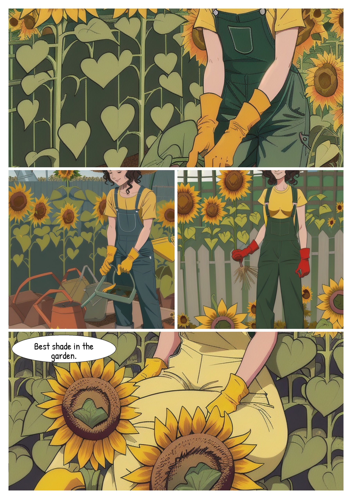
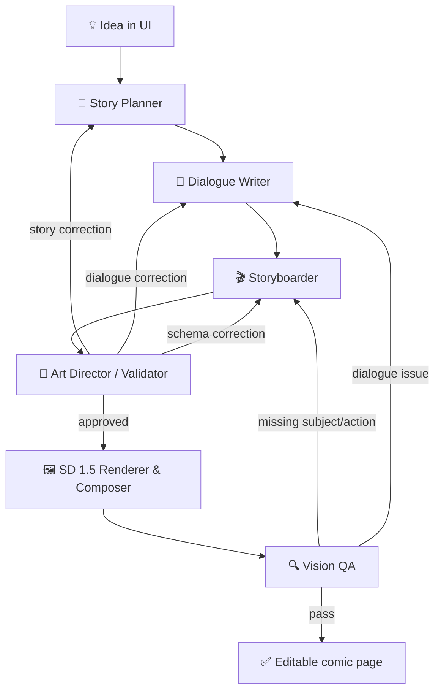
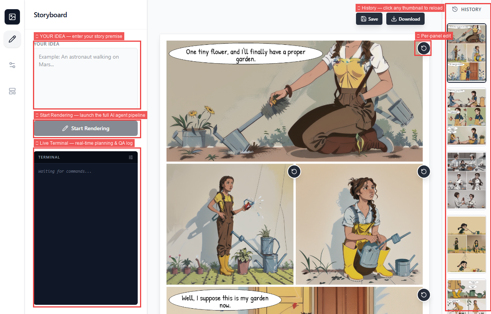
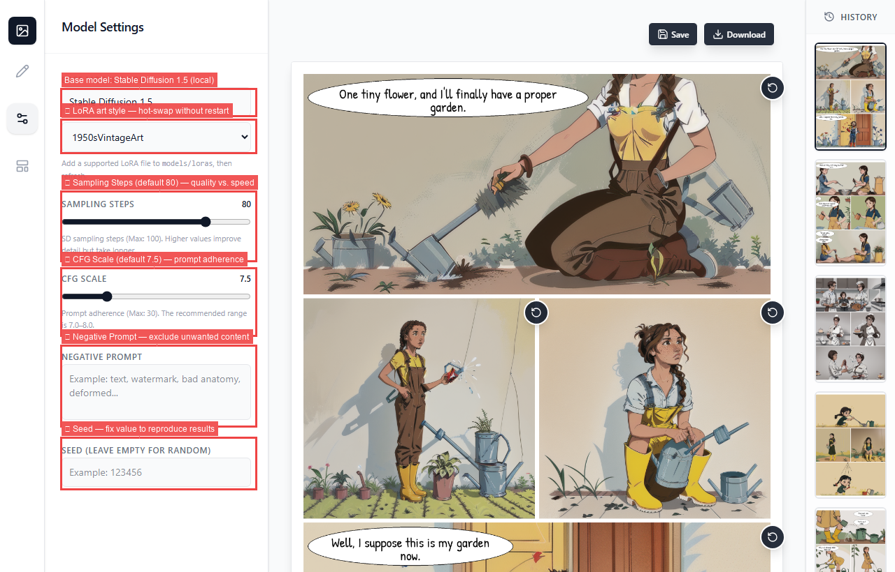
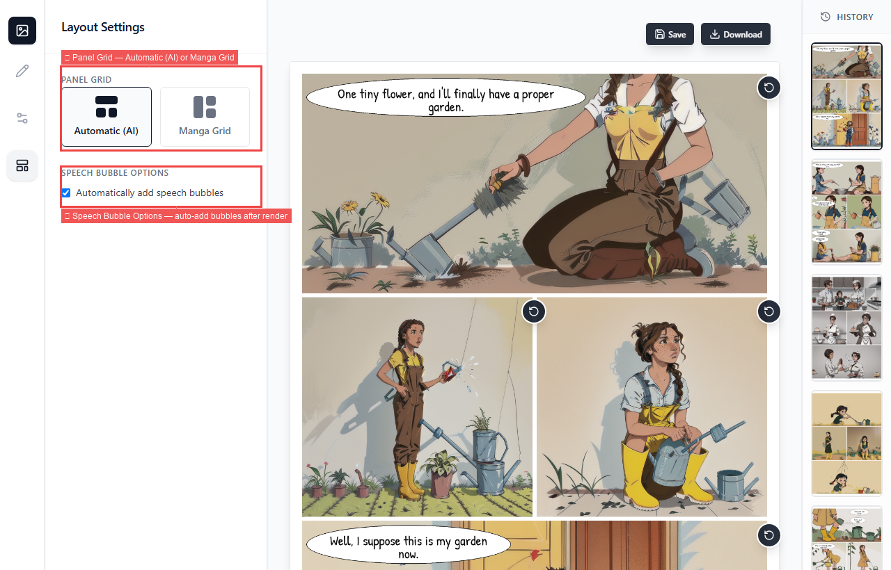
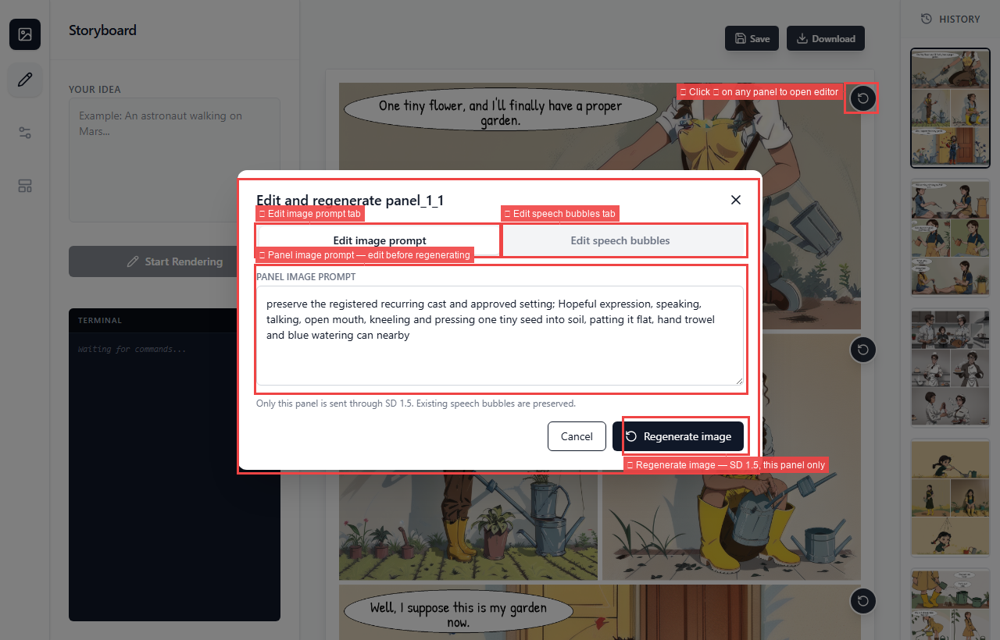

# ComicStudio

> An autonomous AI agent acting as a complete virtual comic studio. It integrates with a lightweight, locally running Stable Diffusion 1.5 model to give you precise control over generating, editing, and arranging short comic books from a single idea.

*Inspiration: This project's concept and workflow were inspired by the excellent [AI Comic Factory](https://huggingface.co/spaces/jbilcke-hf/ai-comic-factory).*

<p align="center">
  
  
</p>

The examples above show the complete output: sequential panels, generated artwork, layout, and speech bubbles.

## What the project does 🧩

| Feature | What it provides |
| --- | --- |
| **Story planning** | Converts an idea into characters, setting, props, causal beats, and a visual payoff. |
| **Dialogue writing** | Creates short dialogue in English or Vietnamese and keeps silent panels silent. |
| **Storyboard validation** | Checks panel order, character continuity, actions, required props, and dialogue consistency. |
| **AI panel rendering** | Generates each panel locally with Stable Diffusion 1.5 and an optional SD 1.5 LoRA. |
| **Long prompts** | Uses [Compel](https://github.com/damian0815/compel) chunking and prompt weighting instead of silently truncating long panel descriptions. |
| **Page composition** | Arranges panels in automatic or manga-style layouts and adds speech bubbles after rendering. |
| **Vision QA** | Sends the actual page to a vision model to check missing subjects, props, actions, continuity, and irrelevant content. |
| **Targeted retry** | Feeds QA corrections back into the graph; the API allows up to three QA retries (up to four render attempts including the first pass). |
| **Panel editing** | The regenerate icon on each panel lets the user edit the image prompt or dialogue separately. |
| **Save and download** | Saves a page to `outputs/saved` or downloads its PNG from the browser. |
| **Live progress** | Streams planner, renderer, and QA events to the UI while a page is being generated. |

## Agent workflow 🤖



1. **Story Planner** creates structured story beats and a fixed character description.
2. **Dialogue Writer** writes concise lines that advance the same story.
3. **Storyboarder** turns the plan into panel prompts, actions, props, and dialogue.
4. **Validator / Art Director** repairs inconsistent or incomplete storyboard data.
5. **Renderer & Composer** generates panel artwork using the local SD 1.5 checkpoint, builds the page layout, and places editable speech bubbles.
6. **Vision QA** inspects the rendered page. When it fails, its corrections are routed back to the storyboarder (or dialogue writer) to intelligently fix the prompt before re-rendering.

## Requirements 📦

- Python 3.11 or newer.
- Node.js LTS and npm.
- An NVIDIA GPU with a CUDA-enabled PyTorch build is recommended for rendering. CPU mode is only practical for small tests.
- An OpenAI-compatible chat/vision endpoint for planning and QA.
- A local Stable Diffusion 1.5 checkpoint.

## Generation cost and retry behavior ⏱️

- A request creates one comic page containing several panels; it does not intentionally create several independent pages.
- Vision QA runs after the first render. If it finds a missing subject, prop, action, continuity problem, or dialogue mismatch, its correction is routed back into the graph.
- The API default is `MAX_VISION_RETRIES=3`: one initial render plus at most three replacement renders. The current page is replaced in the UI and History, while job metadata remains available under `outputs/jobs`.
- The slowest stage is usually **Stable Diffusion panel rendering**, especially the larger panels at 80 steps. Model loading, LoRA loading, page composition, and Vision QA add overhead, but diffusion denoising dominates local GPU time.
- Compel improves how long prompts are encoded; it does not make SD 1.5 understand complex actions perfectly and does not reduce diffusion time.

## Installation 🛠️

```powershell
git clone <repository-url>
cd ComicBookGenerator
py -3 -m venv .venv
.\.venv\Scripts\Activate.ps1
python -m pip install --upgrade pip
python -m pip install -r requirements.txt
cd frontend
npm install
cd ..
```

On Linux or macOS, activate with `source .venv/bin/activate` and use `python3` where needed.

## Model setup 🎨

### Base model

Download any **Stable Diffusion 1.5** checkpoint (`.safetensors` or `.ckpt`) from Hugging Face or Civitai and place it in:

```text
models/base/
```

The default config expects `models/base/comicBabes_v2.safetensors`, but any SD 1.5 checkpoint works. To use a different filename, update `base_model` in `config.py`.

Model weights are intentionally not committed and are not downloaded automatically at startup.

### LoRA styles

Place SD 1.5-compatible LoRA files here:

```text
models/loras/
```

The UI discovers `.safetensors`, `.pt`, and `.ckpt` files from this directory. Add a file, refresh the page, then select it in **Model Settings**. A LoRA must match the SD 1.5 base model; styles trained for another architecture are not interchangeable.

### Negative embedding (optional)

A negative embedding (e.g. `negative_hand-neg.pt` from Civitai) can reduce common SD 1.5 artifacts like deformed hands. Place the file in:

```text
models/embeddings/
```

Then set `negative_embedding` in `config.py` to the file path. This is **entirely optional** — if the file is missing or the field is `None`, the app runs normally without it.

## API configuration 🔐

Copy the example environment file:

```powershell
Copy-Item .env.example .env
```

Then set an OpenAI-compatible endpoint in `.env`:

```env
OPENAI_API_KEY=your_api_key
OPENAI_BASE_URL=https://api.openai.com/v1
# Model for story planning, dialogue, storyboard, and validation
OPENAI_CHAT_MODEL=gpt-4o
# Vision-capable model for QA (leave empty to reuse OPENAI_CHAT_MODEL)
OPENAI_VISION_MODEL=gpt-4o
```

Change `OPENAI_CHAT_MODEL` or `OPENAI_VISION_MODEL` to a model exposed by your OpenAI-compatible provider. Use a vision-capable model for QA. Restart the backend after changing `.env`. Never commit `.env` or expose the key in a notebook, log, screenshot, or frontend bundle.

## Run the application ▶️

Start the backend in terminal 1:

```powershell
.\.venv\Scripts\Activate.ps1
python api.py
```

Start the frontend in terminal 2:

```powershell
cd frontend
npm run dev -- --host 127.0.0.1
```

Open:

- UI: <http://127.0.0.1:5173>
- API docs: <http://127.0.0.1:8000/docs>

Enter an idea in **Storyboard**, choose a LoRA in **Model Settings**, choose a page layout, and click **Start Rendering**. `colab_model_test.ipynb` contains the GPU-oriented Colab setup; keep the checkpoint in Drive or upload it separately.

## UI controls 🖥️

The interface is designed to give users full control over the generation process, allowing you to adjust parameters, choose layouts, select LoRAs, and regenerate specific panels. It is divided into three settings tabs, a result canvas, and a history rail:

### ✏️ Storyboard tab

<p align="center">
  
</p>

- **Your Idea** — enter the premise, characters, situation, language, or desired tone.
- **Start Rendering** — sends the idea to the agent graph and starts the complete workflow.
- **Terminal** — shows live planning, validation, rendering, retry, and error messages.

### ⚙️ Model Settings tab

<p align="center">
  
</p>

Users can flexibly adjust generation parameters to control the final artwork:
- **Base Model & LoRA selector** — displays the active SD 1.5 pipeline and lets you dynamically choose a style discovered from `models/loras`.
- **Sampling Steps & CFG Scale** — use the sliders to control diffusion quality, render time, and how strongly the image follows the prompt.
- **Negative Prompt** — adds things to avoid, such as text artifacts, extra characters, or bad anatomy.
- **Seed** — use a fixed number to reproduce a result or leave it empty for a new random result.

### 🧱 Layout Settings tab

<p align="center">
  
</p>

Customize the visual flow of your comic page:
- **Panel Grid** — choose between **Automatic (AI)** for a suitable AI-determined arrangement, or select a specific **Manga Grid** for vertical reading layouts.
- **Detailed Layout** — manually pick the panel proportions.
- **Speech bubbles** — toggle automatic post-render bubble and dialogue generation.

### 🖼️ Result canvas & Regeneration

<p align="center">
  
</p>

- Displays the generated comic page and its panels.
- **Regenerate icon** — the circular-arrow button in the upper-right of each panel opens the editor overlay.
  - **Edit image prompt** — fine-tune the prompt and regenerate *only* that specific panel, preserving the rest of the page.
  - **Edit speech bubbles** — rewrite the dialogue text without re-running the heavy diffusion process.
- **Save & Download** — save the page to `outputs/saved` or download it directly as a PNG.

### 🕘 History

- Shows previously generated pages as thumbnails.
- Clicking a thumbnail reopens that page in the result canvas.

Example dialogue payload for the panel editor:

```json
[
  {
    "character_id": "gardener",
    "text": "Best shade in the garden.",
    "emotion": "pleased"
  }
]
```

## Project structure 🗂️

```text
api.py                 FastAPI API, streaming events, save and regeneration endpoints
config.py              Model, quality, layout, and LoRA configuration
studio_graph/          LangGraph agents and conditional retry routing
panel_engine/          SD 1.5 prompts, Compel, and panel rendering
core/                  Stable Diffusion pipeline wrapper
page/                  Panel layouts and page composition
bubbles/               Speech-bubble detection and text rendering
frontend/              React + TypeScript UI
models/base/           Local SD 1.5 checkpoints (ignored by Git)
models/loras/          User LoRAs (ignored by Git)
images/curated/        Reviewed README demo images
outputs/               Generated pages and job metadata (ignored by Git)
```

## Troubleshooting 🩺

- **Checkpoint missing:** verify `models/base/comicBabes_v2.safetensors` or update `CONFIG.models.base_model`.
- **CUDA unavailable:** verify the NVIDIA driver, CUDA PyTorch build, and `torch.cuda.is_available()`.
- **Generation is slow:** use fewer steps while testing, lower render dimensions, or use a GPU.
- **LoRA error:** confirm that the LoRA is made for SD 1.5 and matches the base checkpoint.
- **Vision QA error:** verify that the configured model and endpoint accept image input.
- **Authentication or quota error:** check `OPENAI_API_KEY`, `OPENAI_BASE_URL`, model access, and account credit.

